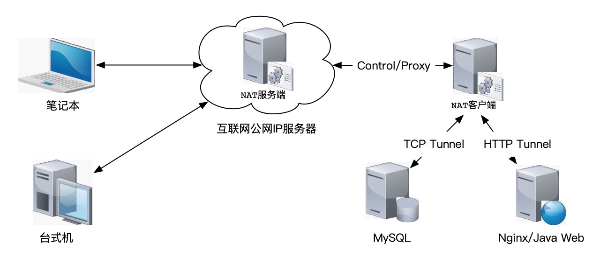

## 项目简介

类似 [Ngrok](https://github.com/inconshreveable/ngrok) 和 [FRP](https://github.com/fatedier/frp) ，基于Netty实现的NAT内网穿透访问软件。

整个项目设计实现思路借鉴 [Ngrok](https://github.com/inconshreveable/ngrok) ，其实现原理和过程可参考其官方资料和网上资料。

**entdiy-nat-common** - 公共组件类代码模块

**entdiy-nat-server** - Server服务端代码模块

**entdiy-nat-client** - Client客户端代码模块

**entdiy-nat-tester** - 可选模块，作为client穿透的目标测试服务，开发调试用途

**devops** - 提供一套简单的脚本和配置实现软件快速部署运行

### 项目托管同步更新GIT资源库：

**https://github.com/xautlx/entdiy-nat**

**https://gitee.com/xautlx/entdiy-nat**

## 快速开始

特别提示：以下相关命令基于Mac或Linux等环境，Windows系统请参考相关脚本自行转换命令执行。

详情请访问：[基于Netty的开源NAT内网穿透软件使用指南](./devops/README.md)

## 功能列表

已实现功能列表：

* **TCP协议穿透** - TCP协议网络访问穿透，如常见的SSH、MySQL等，当然不局限于这些服务，只要是TCP协议理论均可穿透访问
* **HTTP协议穿透** - 典型网页服务HTTP协议穿透支持
* **连接池处理** - Server端与Client端的Proxy Channel采用简化连接池实现，提升穿透连接的初始化连接速度和效率
* **Client重连机制** - 由于网络异常或Server端重启，需要Client重连机制来实现连接中断后自动重连Server
* **Client/Secret&Token安全认证机制** - 基于client和secret及token机制实现基础的访问认证支持
* **SSL证书支持** - 引入SSL证书支持，提升穿透访问数据安全性（处理性能损耗较大，默认关闭，待优化）

## 路线计划

待实现功能列表：

* **HTTPS协议穿透** - （暂不考虑）建议采用在服务端Nginx层面HTTPS反向代理NAT层面的HTTP服务
* **HTTP子域名访问支持** - （暂不考虑）支持采用和TCP相似的远端端口访问穿透服务，建议采用服务端Nginx层面反向代理不同子域名到不同端口HTTP服务
* **Server端Tunnel定义控制** - 典型的内网穿透都是由Client定义隧道，但是对于一些业务场景需要由Server进行全局的各Client端的隧道定义实现灵活的Server端管控支持

## 项目故事

### 关于内网穿透

对于内网穿透本身是一个很通用的需求概念，
目前比较主流常用的有 [Ngrok](https://github.com/inconshreveable/ngrok) 和 [FRP](https://github.com/fatedier/frp)
以及 花生壳、向日葵 之类的软件，在此不再赘述，具体可以自行网上搜索了解。

那内网穿透这个概念和这个项目有什么关系呢？且继续往下看：

### 关于物联设备接入

以典型的人脸门禁设备接入，不同厂商提供不同SDK实现与设备通讯，不外乎两种典型访问模式：

* 在设备配置定义服务端的IP和端口，通俗讲就是设备找服务器

* 在服务端配置定义设备的IP和端口，通俗讲就是服务器找设备 

应该说两种模式各有优缺点很好理解不再细说，不同厂商一般也就是两种模式二选一，例如海康设备就是典型的服务器找设备模式。

一般项目规模初期或是企业内部应用环境，服务器和各物联设备都在一个局域网体系，通过厂商SDK实现了各种设备接入服务运作良好。
但是突然有一天出现需求：需要把当前网络之外的设备，诸如其他异地厂区的设备接入到总部系统。
例如以往通过局域网IP和端口访问的海康门禁设备，突然走不通了，公网IP服务器如何访问到其他网络的设备成了个问题。

当然，对于土豪企业通过VPN来解决此问题的方式不在我们讨论之列。
通过向海康客服咨询得到的反馈也是通过端口映射、为设备分配公网IP、或者采用海康的平台软件中转对接等几种方式，
基于公网IP和端口映射这类方式涉及软硬件成本问题，一般实际可操作性不强，一般很自然的方式就会联想到在异地设备所在局域网络架设一个中转服务来实现。

无论是通过厂商的中转对接软件，亦或是基于厂商SDK实现一套部署在设备所在局域网的中转服务程序，我们可以俗称为物联网关程序，其部署所在硬件可俗称物联网关设备，
可以理解为是一种典型的"胖客户端"模式，而这种模式主要问题是：

* 胖客户端模式升级更新很麻烦，客户端中转程序有任何Bug修复那都需要把所有网关设备都手工更新一遍或者实现一套完善的自动更新分发机制；

* 例如原先已经完整实现了海康SDK设备接入程序，但是现在新增胖客户端中间层，势必又得基于这套网关程序额外定制开发一套接入程序；

因此，有必要尝试一种极简的"瘦客户端"模式来解决上述问题，结合作者多年Ngrok的使用经验，感觉以内网穿透的概念来实现这个"瘦客户端"是一个比较合适的选择：
服务端以内网穿透的方式访问设备，"感觉上"就好像是之前连接局域网设备一样，
客户端唯一做的事情就是实现内网穿透通讯数据转发，不做任何业务处理，程序稳定无需频繁更新，
同时直接沿用原先已成型局域网设备接入程序，无需客户端或服务端新增定制接入开发。

### 为啥重复造轮子

既然上面已经有类似这样的内网穿透的成熟软件，为啥又重复造个轮子呢？原因如下：

诸如开源版本Ngrok基本都是以Client端定义Tunnel穿透隧道，而从上述业务背景来看，一般是需要从Server服务端集中管理设备穿透配置信息，
以及后期业务扩展支持更多高级管理特性，有必要定制一个持续可维护的项目；

因此，如果你是对于Java/Netty感兴趣、对于内网穿透感兴趣，可以关注探讨。
当然，项目时间不长，还没有Ngrok和FRP之类软件的完整和成熟，请注意斟酌评估应用风险。

