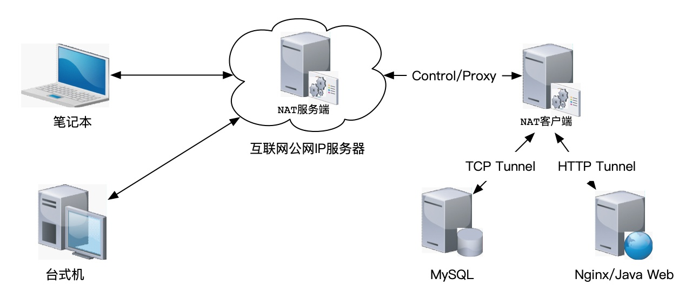

## 基于Netty的开源NAT内网穿透软件使用指南

类似 [Ngrok](https://github.com/inconshreveable/ngrok) 和 [FRP](https://github.com/fatedier/frp) ，基于Netty实现的NAT内网穿透访问软件。



整个项目设计实现思路借鉴 [Ngrok](https://github.com/inconshreveable/ngrok) ，其实现原理和过程可参考其官方资料和网上资料。

### 项目托管同步更新GIT资源库：

项目文档和完整源码请移步访问：

**https://github.com/xautlx/entdiy-nat**

**https://gitee.com/xautlx/entdiy-nat**

## 详细安装配置使用过程和技巧

**特别提示：**

* 以下相关命令基于Mac或Linux等环境，Windows系统请参考相关脚本自行转换命令执行。

* 实际应用一般是需要一台公网IP服务器作为穿透访问中转机器，当然出于体验也可以在本地网络不同机器安装配置。

### Server端配置运行

* 获取整个项目，并进入项目devops目录。

* entdiy-nat-server为服务端程序，整个目录复制到公网IP服务器主机。

* 可以把application-server.yml文件看做是提供的模板配置，里面提供完整可配置项展示和注释说明，
复制application-server.yml创建application-local.yml，复制创建的application-local.yml中按需修改的配置会覆盖模板配置文件中内容。

模板配置示例如下，复制到local文件后请参考注释按需修改（特别注意需要为所有client接入端定义标识和秘钥，如entdiy和entdiy-ssh）：

```yaml

server:
  # Web管理端口，默认0表示随机端口(可通过启动日志查看运行端口)，亦可设定为当前机器空闲固定网络端口
  # 暂无意义，后期提供Web管理功能后可指定端口便于访问控制
  port: 0
logging:
  level:
    # 业务默认INFO级别提供常规日志输出，遇到问题可相关修改为DEBUG
    com.entdiy: INFO
    # 心跳日志单独输出至logs目录下-heartbeat.log后缀日志文件，便于直观了解心跳健康情况
    com.entdiy.nat.heartbeat: INFO
    # Netty日志级别控制，DEBUG级别会输出详细的IN/OUT数据包信息
    io.netty.handler.logging: INFO
    root: INFO
nat:
  # 暂未实现
  #domain: 127.0.0.1
  # 提供HTTP穿透的服务端端口
  # 如果默认80端口已经被Nginx等占用，可修改为其他端口，然后在Nginx配置proxy_pass反向代理httpAddr端口服务
  httpAddr: 80
  # 提供HTTPS穿透的服务端端口
  # 如果默认443端口已经被Nginx等占用，可修改为其他端口，然后在Nginx配置proxy_pass反向代理httpsAddr端口服务
  # 暂未实现
  #httpsAddr: 443
  # 供NAT客户端穿透访问的主服务端口，如果端口占用需要修改请注意保持server和client端同步修改
  tunnelAddr: 4443
  # 请根据各个client不同标识对应设置client标识和秘钥
  clients:
    entdiy:
      secret: entdiy123
    entdiy-ssh:
      secret: entdiy123

```

* 修改配置完成后，可反复执行 ./nat-server-cli.sh restart 来启动验证配置，最终可以看到大致的成功日志信息：

```shell script

2021-03-02 23:45:47.771  INFO 4853 - [      main]   c.e.n.s.l.NatControlListener[ 76] Listening for control and proxy connections: [id: 0x2c4eea5f, L:/0.0.0.0:5555]

```

* 脚本执行后会默认显示当前运行日志信息，可以Ctrl+C终止退出日志显示，但程序并未终止，处于后台运行状态。可访问logs目录下查看相关日志输出。

### Client端配置运行

* entdiy-nat-client为客户端程序，整个目录复制到待穿透访问服务所在网络的客户端主机，客户端服务可以是部署在单独机器或者某个需要穿透访问的机器均可。

**技巧提示：** 

作为客户端程序，最常见的需求是希望能提供一个稳定的SSH访问支持，因为日常可能需要SSH访问到客户端主机进行管理操作，
而一般业务服务的MySQL、Nginx穿透等有可能不时需要调整穿透配置，如果把稳定的SSH与MySQL等业务服务放在一起配置运行就会存在个问题：
客户端因为业务调整了配置需要重启，势必导致当前SSH访问立即中断，万一遇到配置错误导致客户端无法正常启动，那就导致SSH访问能力彻底失效也就没法进行远程排查问题了。

因此，一个技巧就是：在需要提供穿透服务的网络范围内，为了提供稳定的SSH远程访问控制能力，专门剥离部署一套SSH NAT客户端程序，
甚至是为了避免单台客户端主机挂掉的单点风险，可以在不同主机部署多个SSH NAT客户端程序注册多个不同远端SSH访问端口，提高远程控制的可靠性。

示例如下：

```shell script

[root@localhost entdiy-nat]# ls -lh /devops/entdiy-nat/
总用量 8.0K
drwxr-xr-x 3 root root 4.0K 3月   2 12:40 entdiy-nat-client
drwxr-xr-x 3 root root 4.0K 2月  27 10:40 entdiy-nat-client-ssh

```

* 不同entdiy-nat-client或entdiy-nat-client-ssh等客户端目录下各自操作配置：
可以把application-client.yml文件看做是提供的模板配置，里面提供完整可配置项展示和注释说明，
复制application-client.yml创建application-local.yml，复制创建的application-local.yml中按需修改的配置会覆盖模板配置文件中内容。

模板配置示例如下，复制到local文件后请参考注释按需修改
（特别注意不同client需要设定不同client标识及秘钥等于server端配置保持一致，如entdiy和entdiy-ssh）：

```yaml

server:
  # Web管理端口，默认0表示随机端口(可通过启动日志查看运行端口)，亦可设定为当前机器空闲固定网络端口
  # 暂无意义，后期提供Web管理功能后可指定端口便于访问控制
  port: 0
logging:
  level:
    # 业务默认INFO级别提供常规日志输出，遇到问题可相关修改为DEBUG
    com.entdiy: INFO
    # 心跳日志单独输出至logs目录下-heartbeat.log后缀日志文件，便于直观了解心跳健康情况
    com.entdiy.nat.heartbeat: INFO
    # Netty日志级别控制，DEBUG级别会输出详细的IN/OUT数据包信息
    io.netty.handler.logging: INFO
    root: INFO
nat:
  # client不可重复，请根据实际信息覆盖设置
  client: entdiy
  secret: entdiy123
  # NAT Server端的公网IP地址或域名
  serverAddr: 127.0.0.1
  # NAT Server端穿透服务端口，对应于server端配置的nat.tunnelAddr
  port: 4443
#    # 以下配置仅做示意，请根据实际情况修改相关参数
#  tunnels:
#    ssh:
#      # 可根据实际情况修改为局域网内服务所在主机IP
#      host: 127.0.0.1
#      port: 22
#      # 服务端穿透访问入口端口，需要确保server端全局唯一
#      remotePort: 122
#    mysql:
#      # 可根据实际情况修改为局域网内服务所在主机IP
#      host: 127.0.0.1
#      port: 3306
#      # 服务端穿透访问入口端口，需要确保server端全局唯一
#      remotePort: 13306

```

* 修改配置完成后，可反复执行 ./nat-server-cli.sh restart 来启动验证配置，最终可以看到类似的成功日志信息：

~~~shell script

2021-03-02 23:51:27.673  INFO 30050 - [pGroup-2-1]    c.e.n.c.l.NatClientListener[104] Success connect to server 47.96.65.93:5555
2021-03-02 23:51:27.849  INFO 30050 - [      main] o.s.s.c.ThreadPoolTaskExecutor[181] Initializing ExecutorService 'applicationTaskExecutor'
2021-03-02 23:51:27.854  INFO 30050 - [pGroup-2-1] c.e.n.c.h.ClientControlHandler[156] Application version (client)1.1.0/(server)1.0.0
2021-03-02 23:51:27.916  INFO 30050 - [pGroup-2-1] c.e.n.c.h.ClientControlHandler[226] Forwarding TCP://47.96.65.93:13306 -> 127.0.0.1:3306
2021-03-02 23:51:27.917  INFO 30050 - [pGroup-2-1] c.e.n.c.h.ClientControlHandler[226] Forwarding TCP://47.96.65.93:16379 -> 127.0.0.1:6379

~~~

* 同时server端日志也能同步看到类似日志信息：

```shell script

2021-03-02 23:46:06.477  INFO 4853 - [pGroup-3-2] c.e.n.s.h.ServerControlHandler[190] Listening remote channel: [id: 0x399ec0a7, L:/0.0.0.0:13306]
2021-03-02 23:46:06.485  INFO 4853 - [pGroup-3-2] c.e.n.s.h.ServerControlHandler[190] Listening remote channel: [id: 0x4e724395, L:/0.0.0.0:16379]

```

### 安装配置验证

* 正常使用

server端和client端都正常运行起来后，即可按照常规的ssh工具或mysql客户端通过访问Server所在主机公网IP和对应远端端口去连接访问到client端机器对应服务。

* 异常情况

如把server端程序关闭 ./nat-server-cli.sh stop 或 把client端程序关闭 ./nat-client-cli.sh stop，程序作了失败重连处理，
client端默认间隔30秒发起server重连请求，通过client和server两端日志可以看到相关重连过程。程序自动重连成功后，即可再次继续正常穿透访问。

## 最后

本文主要对软件使用做一个简单介绍，后期会逐步补充相关设计说明文档。如果使用或开发过程遇到问题，欢迎 [提交Issue](https://github.com/xautlx/entdiy-nat/issues)
